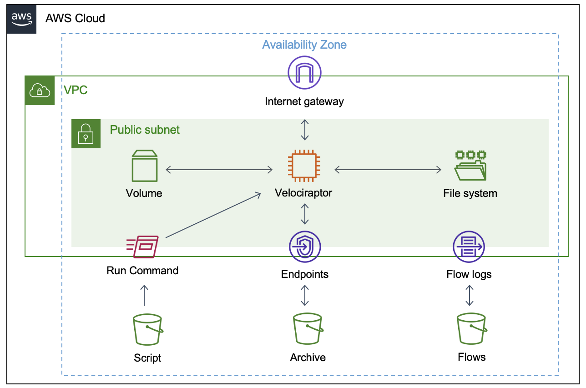

# blue

**Blue** provides Infrastructure as Code for secure deployment of **Velociraptor** into AWS.

https://docs.velociraptor.app/docs/deployment/cloud/



##### Deployment

1. ```wget https://github.com/Velocidex/velociraptor/releases/download/v0.6.5-0/velociraptor-v0.6.5-3-linux-amd64```
2. ```chmod 750 velociraptor-v0.6.5-3-linux-amd64```
3. ``` ./velociraptor-v0.6.5-3-linux-amd64 config generate -i```
4. ```./velociraptor-v0.6.5-3-linux-amd64 --config server.config.yaml debian server --binary velociraptor-v0.6.5-3-linux-amd64```
5. ```dpkg -i velociraptor_0.6.5-3_server.deb```
6. ```systemctl status velociraptor_server.service```
